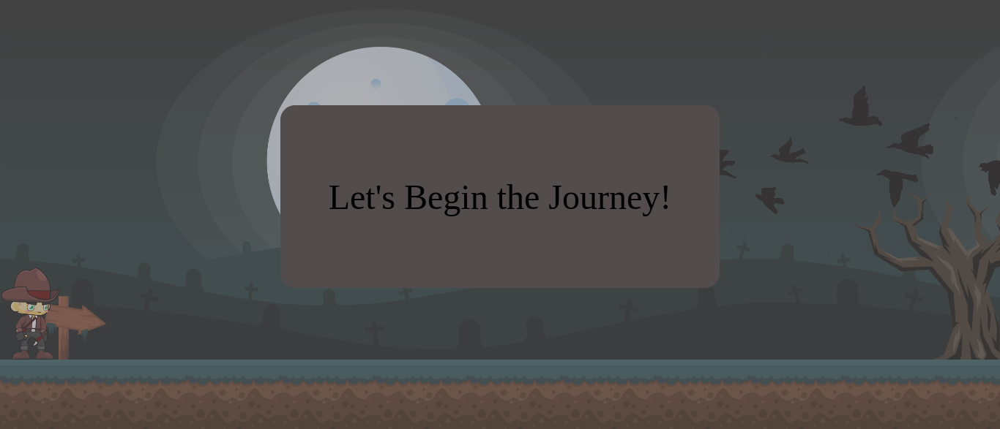
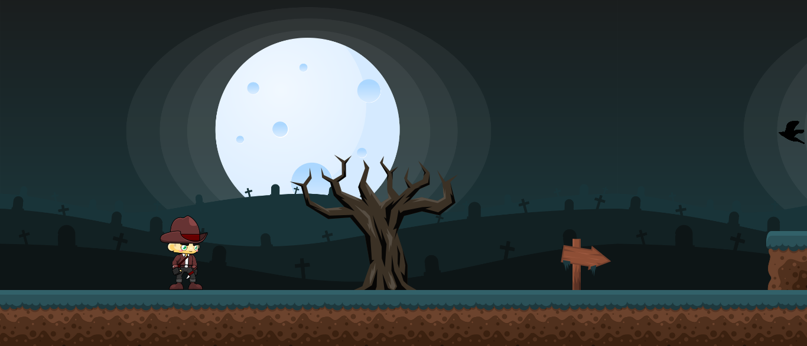

# MINI-GAME
This is a simple game clone made for the game world

## How to copy this repo
* Open the terminal at the place where we want to clone the project.
* Type the command: git clone `https://github.com/Nipuni-Jayathilaka/mini-game.git`
* Then execute the command: `npm i -g`
* Next install the sass using the command: `npm i -g sass`
* Then open the project in vscode 
* Open new terminal in the vscode and execute the command: `sass scss:css`
* Then run the command: `npm install -g npx`
* Then run the command : `npx serve` to get the browser link for the view of the project.

### Version
0.1.0

### License
Copyright © 2022 [https://www.linkedin.com/in/nipuni-jayathilaka-ba9a72182/]Nipuni Jayathilaka. All Rights Reserved.  
This project is licensed under the [MIT](LICENSE.txt) license.

### View

